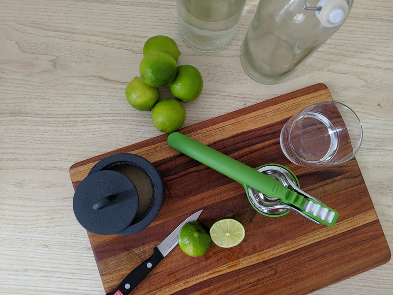
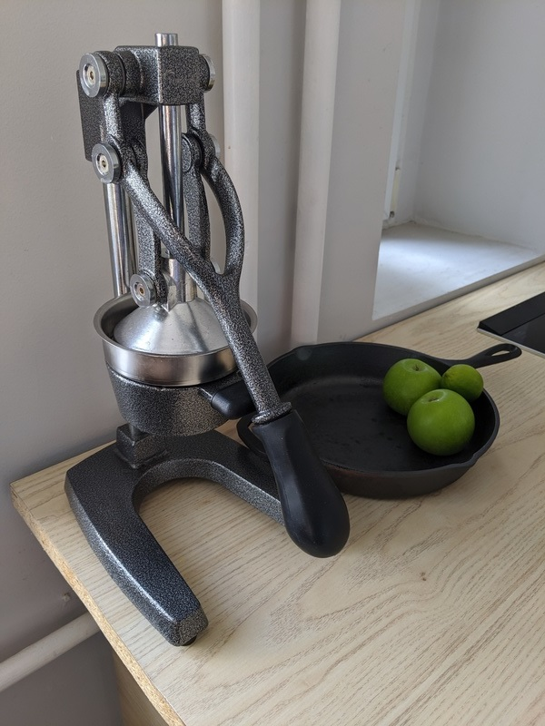

# Citrus Press
Limes! Limes! Limes!

I use a lot of limes, probably more than my fair share, but it's something I'm okay with. Especially when you can find fresh limes for arround eight cents each in peak season. Having freshly made lemonade, or on the side as a garnish for any meal is a worthwhile investement.

Simplest way to get juice out is brute force, cuting it in half and squeezing the juice out of it with your hands. This gets tiresome and is inefficient, leaving a lot of juice in the lime, regardless of how strong you think you are. This can be aided by heating up the lime to reduce the viscosity and break down some cells, rolling beforehand to also break the internal structures before cutting open. Further improvements can come from using a reamer, a ribbed generally wooden tool used to apply presure to the inside of the fruit. 

The best options vary based on scale and use. At the very small scale, such as a garnish for tacos, a cut wedge squezed by hand works well. As you move up ther eare more things to clean and more tools to find space for. In mid scale, a held held press is useful for squezing one to five limes. And moving on to larger bulk production a large levered citrus press can be used to exact a lot of juice. 

The tradeoff is in the number of parts to be cleaned after use, and with more parts having more surface area, more of the juice is left on the surface and gets washed away.

## Chef'n FreshForce Citrus Juicer 
26 EUR | 2019

This is a hand press that is phenomenal. It uses a geared system to increse the force placed on the fruit. This makes it easier to use, even if you dont have that much grip strength since the force is applied over a longer distance. It has slits on the bottom to strain out seeds which work better than holes since the feature can be made narrower and still have great flow.

The limes (or lemons or anything really) are cut in half and placed cut side down in the press and it is closed on top and squezed. This renders almost all the juice along with some oils from the skin but almost no bittness from the pith or excessive oils from the skin. There is almost nothing left to squeze out after the first press and with a flick of the wirst you can open the press and with another eject the husk left over. 

Its construction is a sturdy plastic and a metal part and has a great heft which inspires confidence. It is availibe in two colours, but I fail to see why one would choose the yellow over the green one. Cleanup is also trivial as it is a single piece that can be rinsed with water immedeatly and placed to dry. 

## Levered Citrus Press
40 EUR | 2017

This is a larger press, weights close to 30 lbs (~12kg). Its generally set up for oranges but is large enough to accomate up to grapfruits, but down to key limes might be an issue. The lever's travel is significant and due to the large base and stability, a large force can be applied, sometimes too easily. If you have a few cut fruit sitting ready, using two hands the process of juicing them is fast. A glass can sit underneath and fill up. 

The parts that funnel the pressed juice as well as the pressing surface can be easily removed a rinsed before the juice dries and the rest needs to be wiped down. It is worth th effort given a number of oranges or other citrus.

